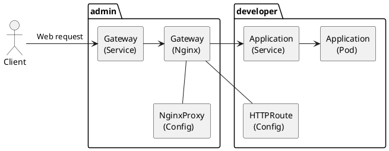

# Gateway API
So far we've used `Ingress` objects to expose web applications running inside
the K8s cluster, to the network outside of K8s (like the internet or just the
LAN). But the Ingress API is growing old, and starts facing [limitations](
  https://gateway-api.sigs.k8s.io/guides/getting-started/migrating-from-ingress/#reasons-to-switch-to-gateway-api)
which is why migrating to the `Gateway` API (it's successor) is recommended.

To be clear, years ago, before the Kubernetes team created the Gateway API and
before it became the standard, there were other Gateways - like the istio
Gateway (networking.istio.io). So when you move from Ingress to "the Gateway
API", make sure you move to the official/standard/Kubernetes "[Gateway](
  https://gateway-api.sigs.k8s.io/reference/spec/#gateway) API". You
might be using the same: `kind: Gateway` but to see exactly which API you're
using, check the `apiVersion`, it should be pointing to
`gateway.networking.k8s.io`. Once this became the standard GW(Gateway) API,
Istio started using it too.

It's always a good idea to have the API reference link at hand:
https://gateway-api.sigs.k8s.io/reference/spec/ .

OK, so that's the API defining the data structures, how things are supposed to
work, etc. The K8s team didn't implement these ideas - they just defined them.

And then there are implementations of that standard Gateway API. And there are
lots of them.

### Diagram
I always feel that a visual helps me a lot, to understand the things we are
talking about.

I'm using the [NGF (NGINX Gateway Fabric)](
  https://docs.nginx.com/nginx-gateway-fabric/) API implementation as an example
here:

When you first install the chart it starts the controller pod. Which is
responsible for detecting the Gateway objects and other `kind` of K8s objects
from this API. This is what NGF calls the control-plane.

Then once you create a `Gateway` object, the control-plane will create a
`Service` and a `Deployment` to handle the web requests. These are called the
data-plane.

You typically only need one `Gateway` to expose all web applications inside the
cluster. It acts as the entry-point proxy(nginx acts as a web proxy in that
deployment) for all your apps.
