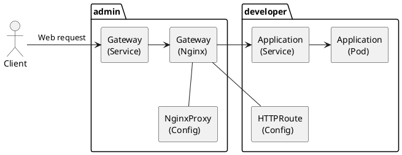

# Gateway API
So far we've used `Ingress` objects to expose web applications running inside
the K8s cluster, to the network outside of K8s (like the internet or just the
LAN). But the Ingress API is growing old, and starts facing [limitations](
  https://gateway-api.sigs.k8s.io/guides/getting-started/migrating-from-ingress/#reasons-to-switch-to-gateway-api)
which is why migrating to the `Gateway` API (it's successor) is recommended.

To be clear, years ago, before the Kubernetes team created the Gateway API and
before it became the standard, there were other Gateways - like the istio
Gateway (networking.istio.io). So when you move from Ingress to "the Gateway
API", make sure you move to the official/standard/Kubernetes "[Gateway](
  https://gateway-api.sigs.k8s.io/reference/spec/#gateway) API". You
might be using the same: `kind: Gateway` but to see exactly which API you're
using, check the `apiVersion`, it should be pointing to
`gateway.networking.k8s.io`. Once this became the standard GW(Gateway) API,
Istio started using it too.

It's always a good idea to have the API reference link at hand:
https://gateway-api.sigs.k8s.io/reference/spec/ .

OK, so that's the API defining the data structures, how things are supposed to
work, etc. The K8s team didn't implement these ideas - they just defined them.

And then there are implementations of that standard Gateway API. And there are
lots of them.

### Diagram
I always feel that a visual helps me a lot, to understand the things we are
talking about.

I'm using the [NGF (NGINX Gateway Fabric)](
  https://docs.nginx.com/nginx-gateway-fabric/) API implementation as an example
here:


When you first install the chart it starts the controller pod. Which is
responsible for detecting the Gateway objects and other `kind` of K8s objects
from this API. This is what NGF calls the control-plane.

Then once you create a `Gateway` object, the control-plane will create a
`Service` and a `Deployment` to handle the web requests. These are called the
data-plane.

You typically only need one `Gateway` to expose all web applications inside the
cluster. It acts as the entry-point proxy(nginx acts as a web proxy in that
deployment) for all your apps.

Then that proxy server will route requests to various destinations inside the
K8s cluster. These destinations are usually service objects that balance/expose
server pods behind them.

To configure the destinations, the API provides the `HTTPRoute` (amongst others)
which the controller picks up and will use to know how to configure the proxy to
handle/redirect requests.

Besides these API objects that configure the proxy/gateway, each API
implementation can also provide other objects(part of their own API) that allow
you to configure even other "non-standard" aspects of the proxy.

### Example
```yaml
# ============================================================================ #
# Authors: Tancredi-Paul Grozav <paul@grozav.info>
# ============================================================================ #
---
# Using ArgoCD to install Gateway API CRDs
apiVersion: argoproj.io/v1alpha1
kind: Application
metadata:
  name: kubernetes-gateway-api
  namespace: argocd
spec:
  project: default
  source:
    repoURL: https://github.com/kubernetes-sigs/gateway-api
    targetRevision: main
    path: config/crd/standard
  destination:
    server: https://kubernetes.default.svc
    namespace: gateway-api
  syncPolicy:
    automated:
      prune: true
      selfHeal: true
    syncOptions:
    - CreateNamespace=true
    - ApplyOutOfSyncOnly=true
    - ServerSideApply=true
# ============================================================================ #
# Install GW API implementation
apiVersion: argoproj.io/v1alpha1
kind: Application
metadata:
  name: nginx-gateway-fabric
  namespace: argocd
spec:
  project: default
  source:
    repoURL: ghcr.io/nginx/charts
    chart: nginx-gateway-fabric
    targetRevision: 2.4.2 # not "*" for prod
  destination:
    server: https://kubernetes.default.svc
    namespace: nginx-gateway-fabric
  syncPolicy:
    automated:
      prune: true
      selfHeal: true
    syncOptions:
    - CreateNamespace=true
    - ApplyOutOfSyncOnly=true
    - ServerSideApply=true
# ============================================================================ #
# This will start the controller and watch for objects


# ============================================================================ #
# Optional, if you want to customize the gateway/proxy, note different API
# ---
# apiVersion: gateway.nginx.org/v1alpha2
# kind: NginxProxy
# metadata:
#   name: custom-config
#   namespace: external-web-gateway
# spec:
#   logging:
#     errorLevel: debug
#     agentLevel: debug
#   # This section allows you to "reach into" the auto-generated data plane
#   # and override the container ports.
#   kubernetes:
#     deployment:
#       replicas: 2
# ============================================================================ #
---
apiVersion: gateway.networking.k8s.io/v1
kind: Gateway
metadata:
  name: web-gateway
  namespace: external-web-gateway # New Namespace for the GW itself
spec:
  # This is created by NGF
  gatewayClassName: nginx
  # Enable this if you want to customize the proxy
  # infrastructure:
  #   parametersRef:
  #     group: gateway.nginx.org
  #     kind: NginxProxy
  #     name: custom-config
  listeners:
  # HTTP listener
  - name: http
    protocol: HTTP
    port: 80
    allowedRoutes:
      namespaces:
        from: All
  # HTTPS listener
  - name: app1-https
    protocol: HTTPS
    hostname: app1.k8s.server.paul.grozav.info
    tls:
      mode: Terminate
      certificateRefs:
      - name: app1-server-tls
        # namespace: X # looks into same NS by default as the Gateway object
    port: 443
    allowedRoutes:
      namespaces:
        from: All
# ============================================================================ #
# will be covered by helm chart after version 2.7.0
---
apiVersion: gateway.networking.k8s.io/v1
kind: HTTPRoute
metadata:
  name: app1-route
  namespace: app1
spec:
  hostnames:
  - app1.k8s.server.paul.grozav.info
  parentRefs:
  - group: gateway.networking.k8s.io
    kind: Gateway
    name: web-gateway
    namespace: external-web-gateway
    sectionName: app1-https # This is the app-specific listener
  rules:
  - backendRefs:
    - namespace: jellyfin
      name: jellyfin # the service name
      port: 8096
      # weight: 1
# ============================================================================ #
```

Note you want different Gateway listeners for different applications/domains if
and only if you have to offer different certificates for different domains. If
you use a wildcard certificate instead, you could use the same listener with
different HTTPRoute objects for each.

The standard GW API allows you to specify multiple `certificateRefs` and the
gateway will check their domains and use the appropriate certificate based on
the domain requested by the user. However, NGF currently only supports 1
certificate reference.
